# Project 3 – Enterprise Network Design and Implementation in Cisco Packet Tracer

---

## Overview

This project demonstrates the design and implementation of a two-department enterprise network from scratch using **Cisco Packet Tracer**. Starting from a single IP block, the network was subnetted into two logical segments, physical devices were placed and connected, a Cisco 2911 router was configured via IOS CLI, static IP addresses were assigned to all endpoints, and cross-department communication was verified through ping testing. This project proves the ability to translate a business network requirement into a fully functional, documented network topology.

---

## Environment

| Tool | Purpose |
|------|---------|
| Cisco Packet Tracer | Network simulation and device configuration |
| Cisco 2911 Router | Inter-department routing |
| Cisco 2960-24TT Switches | Department-level switching (ACCOUNTS and DELIVERY) |
| PC endpoints (PC0, PC1, PC2, PC3) | Department workstations |
| Printers (Printer0, Printer1) | Department network peripherals |
| GitHub | Documentation and version control |

---

## Network Design

### IP Addressing Scheme

Base network: **192.168.40.0** — subnetted into two /25 blocks to create two isolated department segments connected through the router.

| Subnet | Network Address | Usable Range | Broadcast | Department |
|--------|----------------|-------------|-----------|------------|
| Subnet 1 | 192.168.40.0/25 | .1 to .126 | .127 | ACCOUNTS |
| Subnet 2 | 192.168.40.128/25 | .129 to .254 | .255 | DELIVERY |

### Device IP Assignment

| Device | IP Address | Subnet Mask | Default Gateway | Department |
|--------|-----------|-------------|-----------------|-----------|
| Router0 Gig0/0 | 192.168.40.1 | 255.255.255.128 | N/A | Gateway - ACCOUNTS |
| Router0 Gig0/1 | 192.168.40.129 | 255.255.255.128 | N/A | Gateway - DELIVERY |
| PC0 | 192.168.40.2 | 255.255.255.128 | 192.168.40.1 | ACCOUNTS |
| PC1 | 192.168.40.3 | 255.255.255.128 | 192.168.40.1 | ACCOUNTS |
| Printer0 | 192.168.40.4 | 255.255.255.128 | 192.168.40.1 | ACCOUNTS |
| PC2 | 192.168.40.130 | 255.255.255.128 | 192.168.40.129 | DELIVERY |
| PC3 | 192.168.40.131 | 255.255.255.128 | 192.168.40.129 | DELIVERY |
| Printer1 | 192.168.40.134 | 255.255.255.128 | 192.168.40.129 | DELIVERY |

---

## Build Walkthrough

---

### 🟡 Step 1 — Placed the Core Router

Opened Cisco Packet Tracer and placed a **Cisco 2911 router** as the core routing device. The 2911 provides two GigabitEthernet interfaces needed to connect and route between the two department subnets.

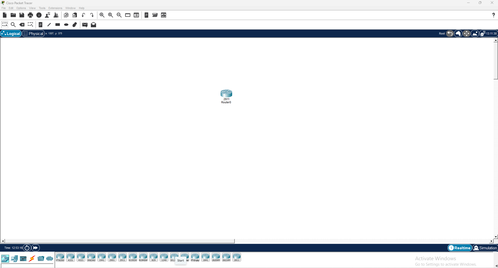
*Cisco 2911 Router0 placed in the logical workspace — starting point of the network build*

---

### 🔵 Step 2 — Added Department Switches

Added two **Cisco 2960-24TT switches** to represent the two department access layers. At this stage the switches were labeled Switch0 and Switch1 before being renamed to reflect their department roles.

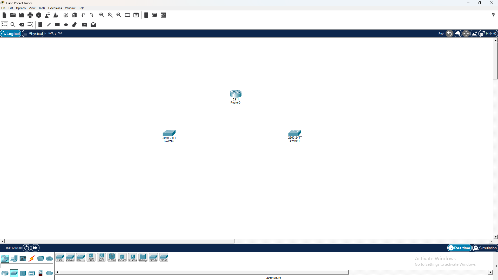
*Two Cisco 2960-24TT switches placed below Router0 — one for each department*

---

### 🟠 Step 3 — Renamed Switches to Department Names

Renamed Switch0 to **ACCOUNTS** and Switch1 to **DELIVERY** to reflect the two business departments. Naming devices clearly is a network documentation best practice — it makes topology diagrams immediately readable and reduces configuration errors.

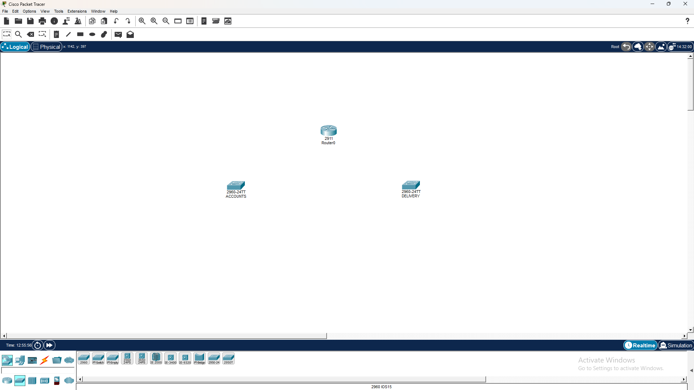
*Switches renamed to ACCOUNTS and DELIVERY — reflecting real department network segmentation*

---

### 🔵 Step 4 — Added Workstation PCs

Added four PC endpoints to the topology. PC0 and PC1 were positioned on the ACCOUNTS side. PC2 and PC3 were positioned on the DELIVERY side. These represent the user workstations in each department.

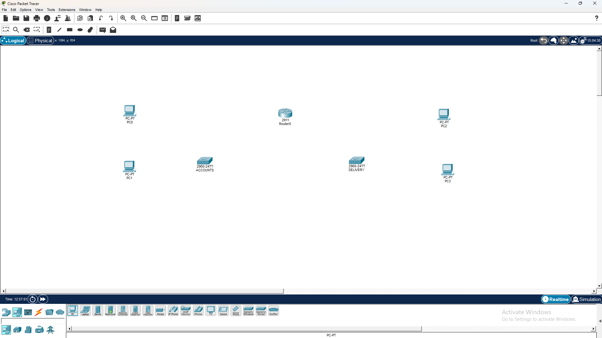
*Four PC workstations placed — PC0 and PC1 for ACCOUNTS, PC2 and PC3 for DELIVERY*

---

### 🟠 Step 5 — Added Department Printers

Added two network printers — **Printer0** for the ACCOUNTS department and **Printer1** for the DELIVERY department. Printers are shared network resources that must be on the correct subnet to be accessible only by their department users.

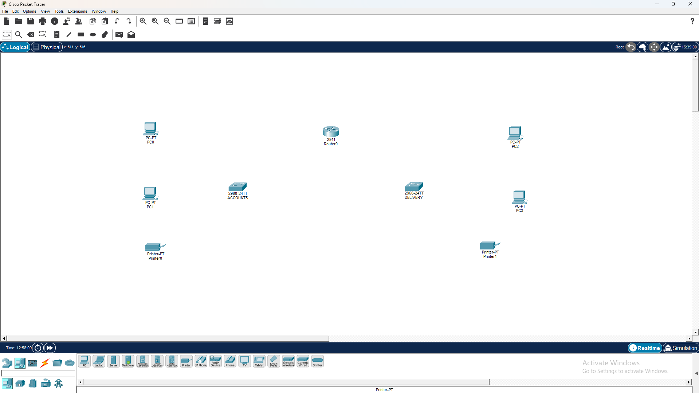
*Printer0 and Printer1 added — one shared printer per department subnet*

---

### 🔴 Step 6 — Connected Router to Switches

Used Cisco Packet Tracer's automatic connection tool to cable the router to both switches. At this stage the links showed red indicators confirming the interfaces were administratively down and not yet configured. This is expected — interfaces must be brought up via CLI before traffic can flow.

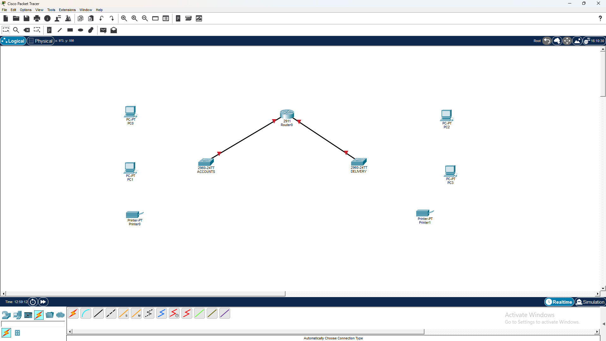
*Router0 connected to ACCOUNTS and DELIVERY switches — red link indicators show interfaces are down pending configuration*

---

### 🟢 Step 7 — Connected All Devices to Their Switches

Cabled all endpoint devices to their respective department switches. PC0, PC1, and Printer0 connected to the ACCOUNTS switch. PC2, PC3, and Printer1 connected to the DELIVERY switch. Green link indicators confirmed the switch-to-device connections were active.

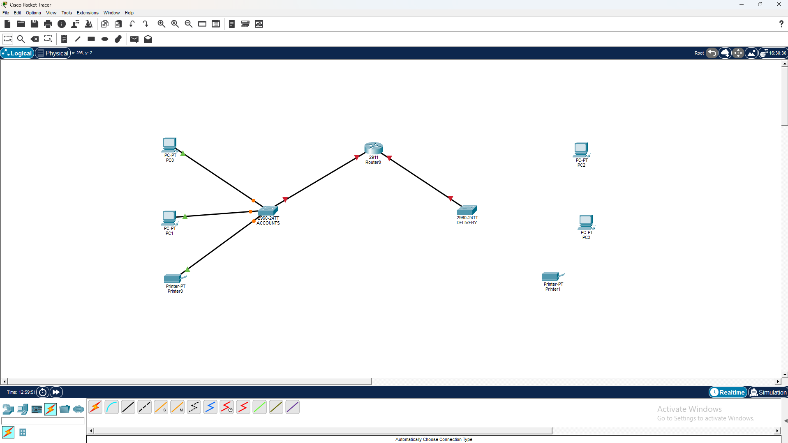
*All endpoints connected to department switches — green indicators confirm active switch-to-device links*

---

### 🔵 Step 8 — Applied Department Color Zones

Added visual color zones to the topology to clearly distinguish the two department segments. The ACCOUNTS department was marked in cyan and the DELIVERY department in orange. This is a professional network documentation technique used in enterprise network diagrams.

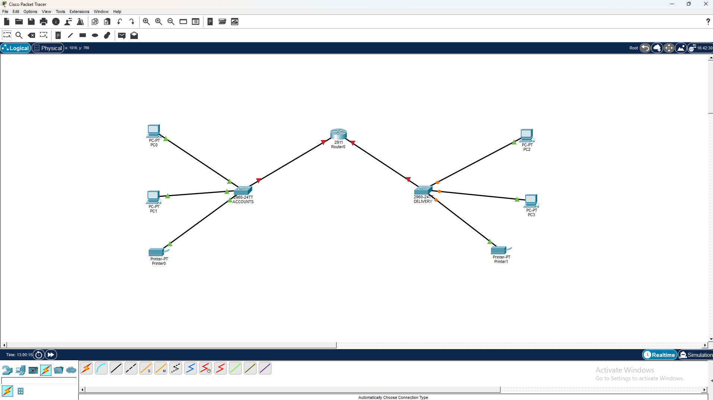
*Color zones applied — cyan for ACCOUNTS department, orange for DELIVERY department*

---

### ⚙️ Step 9 — Configured Router via Cisco IOS CLI (Interface Activation)

Accessed the Router0 CLI and entered privileged exec mode, then global configuration mode. Brought up both GigabitEthernet interfaces using the `no shutdown` command. Confirmed both interfaces transitioned to up/up state as shown by the LINK-5-CHANGED and LINEPROTO-5-UPDOWN messages.

**Commands Used:**

Router>en
Router#config t
Router(config)#int range gig0/0-1
Router(config-if-range)#no shutdown
Router(config-if-range)#do wr

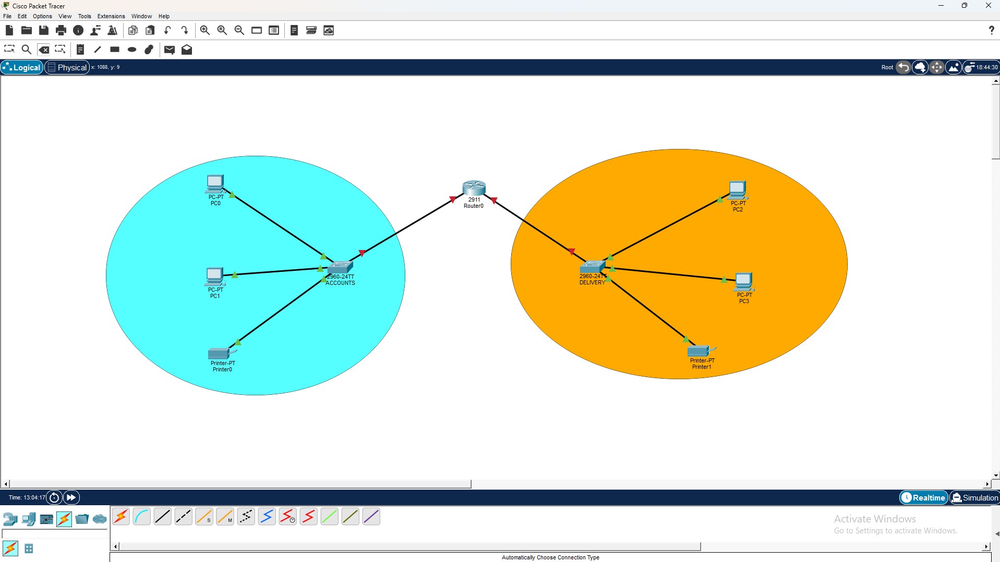
*Router CLI showing both GigabitEthernet interfaces brought up — LINK-5-CHANGED messages confirm interfaces are now active*

---

### ⚙️ Step 10 — Assigned IP Addresses to Router Interfaces

Assigned static IP addresses to both router interfaces — one per department subnet. GigabitEthernet0/0 received 192.168.40.1 as the ACCOUNTS gateway and GigabitEthernet0/1 received 192.168.40.129 as the DELIVERY gateway. Configuration was saved with `do wr`.

**Commands Used:**

Router(config)#int gig0/0
Router(config-if)#ip address 192.168.40.1 255.255.255.128
Router(config-if)#int gig0/1
Router(config-if)#ip address 192.168.40.129 255.255.255.128
Router(config-if)#do wr

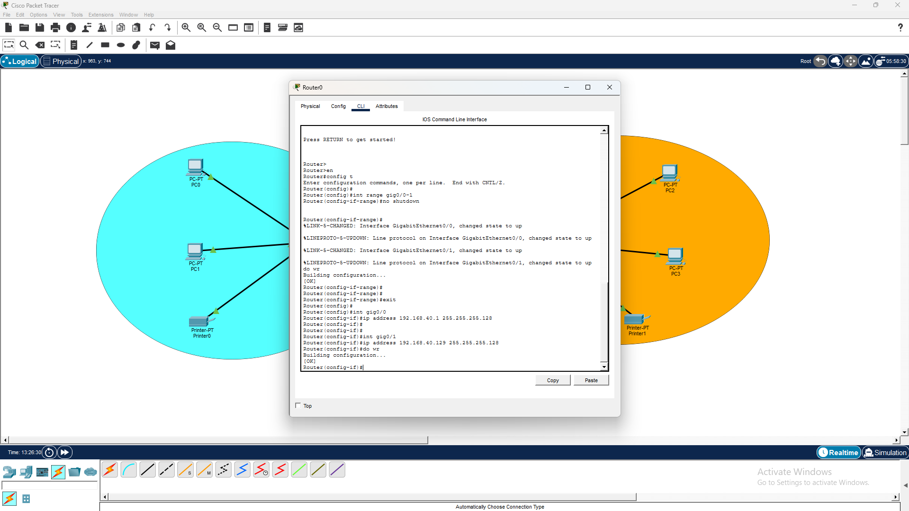
*Router CLI showing IP address assignment to Gig0/0 (192.168.40.1) and Gig0/1 (192.168.40.129)*

---

### ⚙️ Step 11 — Confirmed Subnet Labels on Topology

After router IP assignment the subnet labels appeared on the topology diagram — 192.168.40.0/25 over the ACCOUNTS zone and 192.168.40.128/25 over the DELIVERY zone. The router link indicators also turned green confirming active routing interfaces. This view confirmed the subnetting design was correctly implemented.

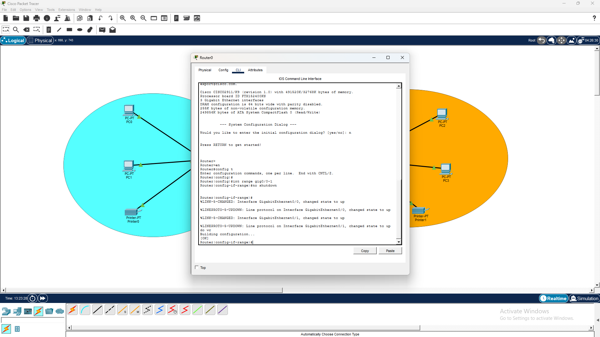
*Subnet labels 192.168.40.0/25 and 192.168.40.128/25 visible on topology — green router links confirm active interfaces*

---

### ⚙️ Step 12 — Verified Router CLI Startup Configuration (Part 1)

Ran `do sh start` to display the full startup configuration and verify all settings were saved correctly. The output showed the running IOS version, hostname, and beginning of the interface configuration.

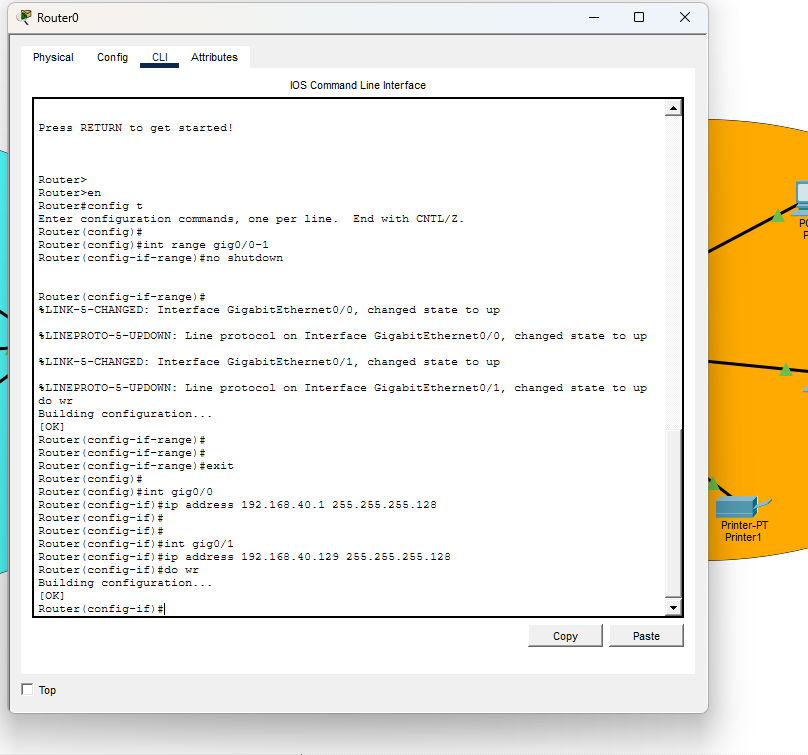
*Router startup configuration output — version 15.1, hostname Router, IOS configuration confirmed saved*

---

### ⚙️ Step 13 — Verified Router CLI Startup Configuration (Part 2)

Continued reviewing the startup configuration output which confirmed both GigabitEthernet interfaces had their IP addresses saved correctly with duplex auto and speed auto settings. GigabitEthernet0/2 showed shutdown confirming unused interfaces were administratively down — a security best practice.

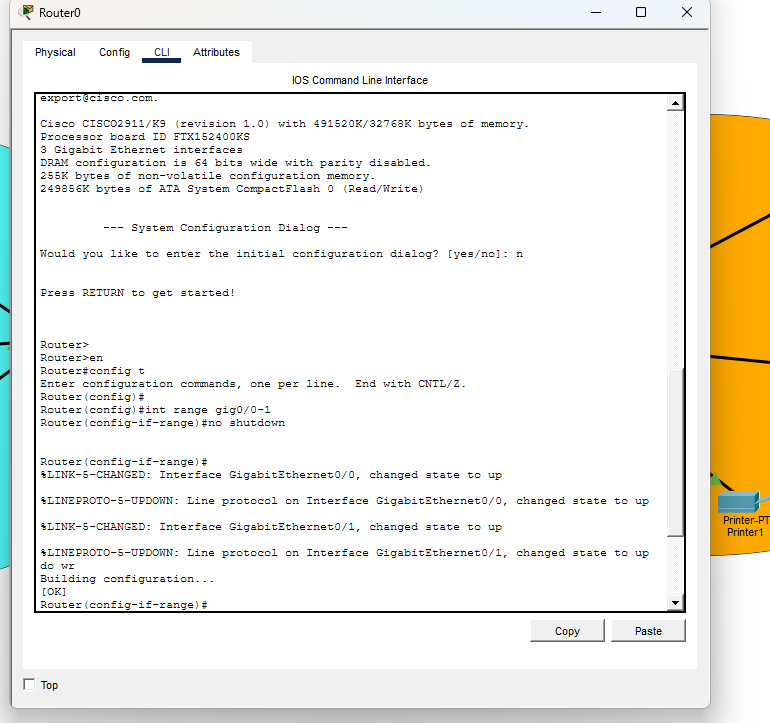
*Startup config showing Gig0/0 at 192.168.40.1 and Gig0/1 at 192.168.40.129 — Gig0/2 correctly shutdown*

---

### 🖥️ Step 14 — Assigned Static IP to PC0 (ACCOUNTS)

Configured PC0 with a static IP address in the ACCOUNTS subnet. Set the default gateway to the router's ACCOUNTS interface.

**PC0 Configuration:**
- IPv4 Address: 192.168.40.2
- Subnet Mask: 255.255.255.128
- Default Gateway: 192.168.40.1

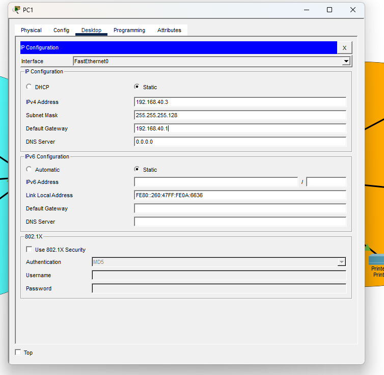
*PC0 IP configuration — 192.168.40.2 with gateway 192.168.40.1 (ACCOUNTS subnet)*

---

### 🖥️ Step 15 — Assigned Static IP to PC1 (ACCOUNTS)

Configured PC1 with a static IP in the ACCOUNTS subnet.

**PC1 Configuration:**
- IPv4 Address: 192.168.40.3
- Subnet Mask: 255.255.255.128
- Default Gateway: 192.168.40.1

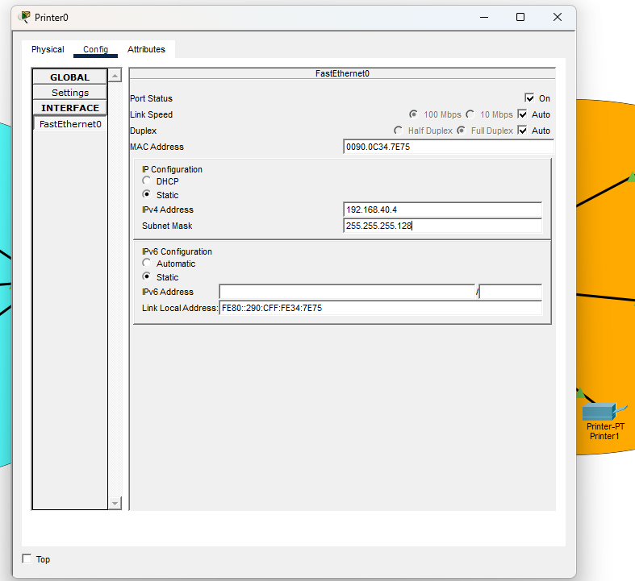
*PC1 IP configuration — 192.168.40.3 with gateway 192.168.40.1 (ACCOUNTS subnet)*

---

### 🖥️ Step 16 — Assigned Static IP to PC2 (DELIVERY)

Configured PC2 with a static IP in the DELIVERY subnet.

**PC2 Configuration:**
- IPv4 Address: 192.168.40.130
- Subnet Mask: 255.255.255.128
- Default Gateway: 192.168.40.129

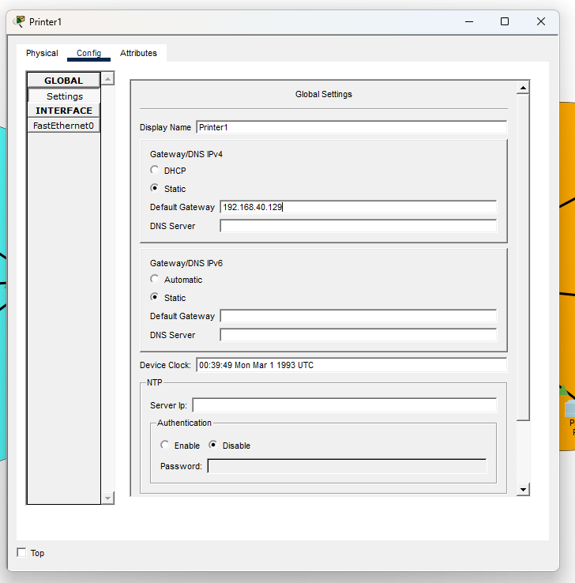
*PC2 IP configuration — 192.168.40.130 with gateway 192.168.40.129 (DELIVERY subnet)*

---

### 🖥️ Step 17 — Assigned Static IP to PC3 (DELIVERY)

Configured PC3 with a static IP in the DELIVERY subnet.

**PC3 Configuration:**
- IPv4 Address: 192.168.40.131
- Subnet Mask: 255.255.255.128
- Default Gateway: 192.168.40.129

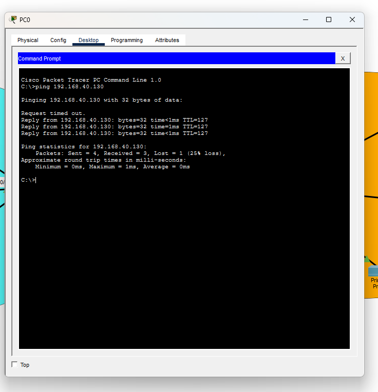
*PC3 IP configuration — 192.168.40.131 with gateway 192.168.40.129 (DELIVERY subnet)*

---

### 🖨️ Step 18 — Assigned Static IP to Printer0 (ACCOUNTS)

Configured Printer0 with a static IP in the ACCOUNTS subnet and set the default gateway to the ACCOUNTS router interface.

**Printer0 Configuration:**
- IPv4 Address: 192.168.40.4
- Subnet Mask: 255.255.255.128
- Default Gateway: 192.168.40.1

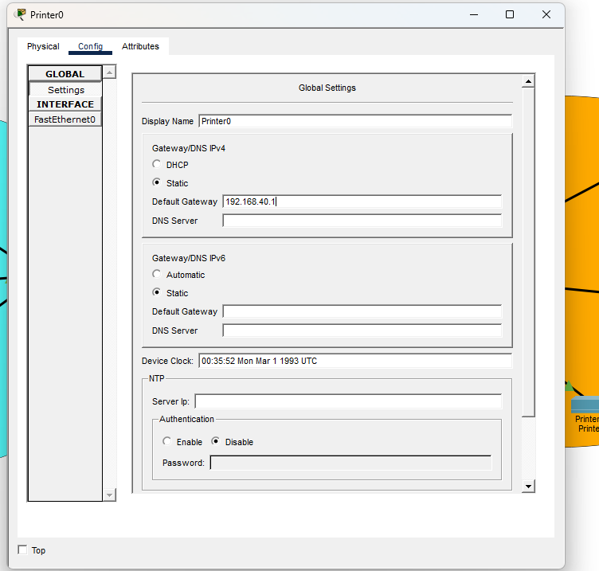
*Printer0 global settings — default gateway set to 192.168.40.1 (ACCOUNTS subnet gateway)*

*Printer0 FastEthernet0 interface — IP 192.168.40.4, subnet mask 255.255.255.128 confirmed*

---

### 🖨️ Step 19 — Assigned Static IP to Printer1 (DELIVERY)

Configured Printer1 with a static IP in the DELIVERY subnet and set the default gateway to the DELIVERY router interface.

**Printer1 Configuration:**
- IPv4 Address: 192.168.40.134
- Subnet Mask: 255.255.255.128
- Default Gateway: 192.168.40.129

*Printer1 global settings — default gateway set to 192.168.40.129 (DELIVERY subnet gateway)*

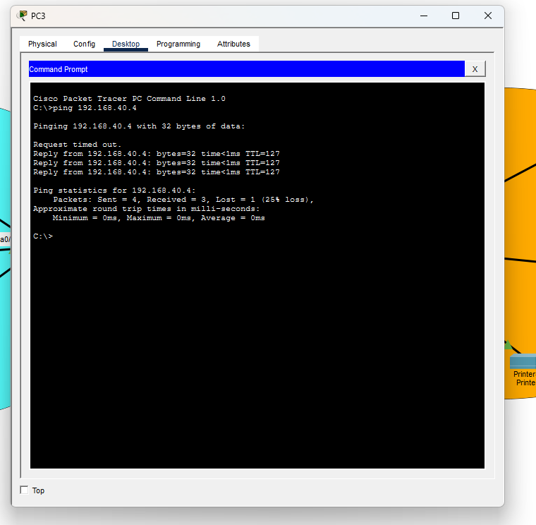
*Printer1 FastEthernet0 interface — IP 192.168.40.134, subnet mask 255.255.255.128 confirmed*

---

### ✅ Step 20 — Verified Cross-Department Connectivity (PC0 to DELIVERY)

Tested cross-department connectivity by pinging from PC0 (ACCOUNTS subnet) to 192.168.40.130 (PC2 in DELIVERY subnet). The ping returned 3 successful replies out of 4 — the first packet timed out which is expected ARP resolution behavior on the first ping. Subsequent replies confirmed the router was correctly routing traffic between the two subnets.

**Ping Result:**
- Sent: 4, Received: 3, Lost: 1 (25% — first packet ARP timeout, expected)
- RTT: Minimum 0ms, Maximum 1ms, Average 0ms

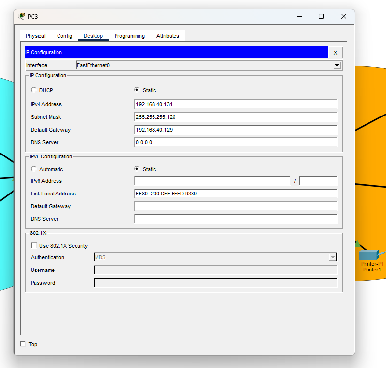
*PC0 successfully pinging 192.168.40.130 in DELIVERY subnet — 3/4 replies confirm inter-subnet routing is working*

---

### ✅ Step 21 — Verified Cross-Department Connectivity (PC3 to ACCOUNTS)

Tested connectivity from the DELIVERY side by pinging from PC3 (DELIVERY subnet) to 192.168.40.4 (Printer0 in the ACCOUNTS subnet). The ping returned 3 successful replies confirming bidirectional routing between departments was functioning correctly.

**Ping Result:**
- Sent: 4, Received: 3, Lost: 1 (25% — first packet ARP timeout, expected)
- RTT: Minimum 0ms, Maximum 0ms, Average 0ms

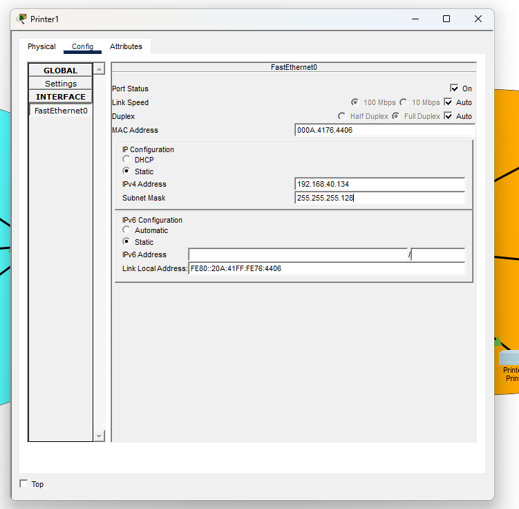
*PC3 successfully pinging 192.168.40.4 (Printer0) in ACCOUNTS subnet — bidirectional routing confirmed*

---

## Final Network Summary

| Component | Count | Details |
|-----------|-------|---------|
| Routers | 1 | Cisco 2911 — inter-department routing |
| Switches | 2 | Cisco 2960-24TT — ACCOUNTS and DELIVERY |
| PCs | 4 | 2 per department |
| Printers | 2 | 1 per department |
| Subnets | 2 | /25 — 126 usable hosts each |
| Total Devices | 9 | All statically addressed and verified |

---

## Skills Demonstrated

| Skill | How It Was Applied |
|-------|--------------------|
| Network Design | Designed a two-department topology from a single IP block |
| Subnetting | Split 192.168.40.0 into two /25 subnets with correct host ranges |
| Cisco IOS CLI | Configured router interfaces, assigned IPs, saved config via CLI |
| Static IP Addressing | Manually assigned addresses to all 9 devices |
| Inter-VLAN Routing | Enabled cross-department communication via router-on-a-stick design |
| Network Verification | Confirmed connectivity using ping across department boundaries |
| Network Documentation | Created labeled topology with color zones, IP tables, and device naming |
| Troubleshooting | Identified and explained expected ARP timeout on first ping |

---

## Lessons Learned

**Subnetting is a business decision, not just a math exercise.** Splitting the network into two /25 subnets was not arbitrary — it reflects a real security principle: departments should be logically separated so that traffic between them passes through a controlled routing point. In a production environment, that routing point would enforce firewall rules, access control lists, and logging. Understanding how to subnet correctly is the foundation of every network security design.

**The CLI confirms what the GUI cannot.** Running `do sh start` after configuration was a critical verification step. It proved that both router interfaces had the correct IPs saved to startup config — meaning a reboot would not lose the configuration. In enterprise environments, engineers verify running config vs startup config as a standard post-change check. This habit prevents outages caused by unsaved configurations.

**The first ping timeout is not a failure — it is ARP.** Both cross-department ping tests showed 1 packet lost on the first attempt. This is expected behavior: the first packet triggers ARP resolution to find the MAC address of the gateway, which takes one packet's worth of time. Understanding why this happens — and being able to explain it clearly — is what separates someone who ran a lab from someone who understands networking.

---

## Real-World Application

Every enterprise network is built on the same foundational concepts demonstrated in this project: subnetting for logical segmentation, routing for inter-segment communication, and static addressing for predictable device management. Help desk engineers need this knowledge to troubleshoot connectivity issues. Network administrators need it to design and expand infrastructure. Security analysts need it to understand how traffic flows before they can monitor, filter, or block it. This project demonstrates the foundational network competency required across all three career paths.

---

## References

- [Cisco IOS Command Reference](https://www.cisco.com/c/en/us/support/ios-nx-os-software/ios-15-1m-t/products-command-reference-list.html)
- [Cisco Packet Tracer Download](https://www.netacad.com/courses/packet-tracer)
- [Subnetting Practice Guide](https://subnettingpractice.com/)
- [NIST SP 800-41 – Guidelines on Firewalls and Firewall Policy](https://csrc.nist.gov/publications/detail/sp/800-41/rev-1/final)
